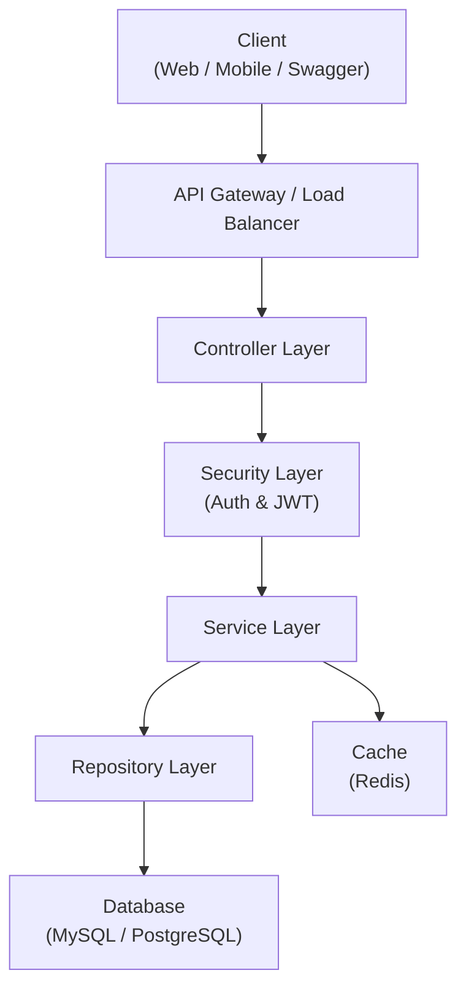
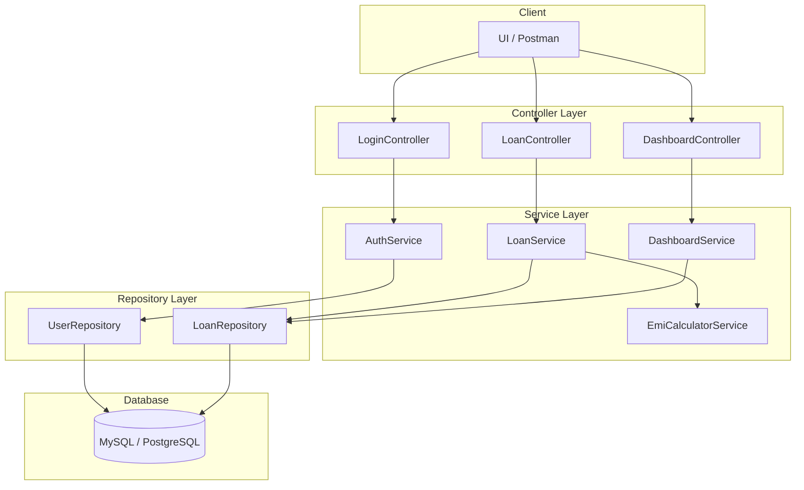
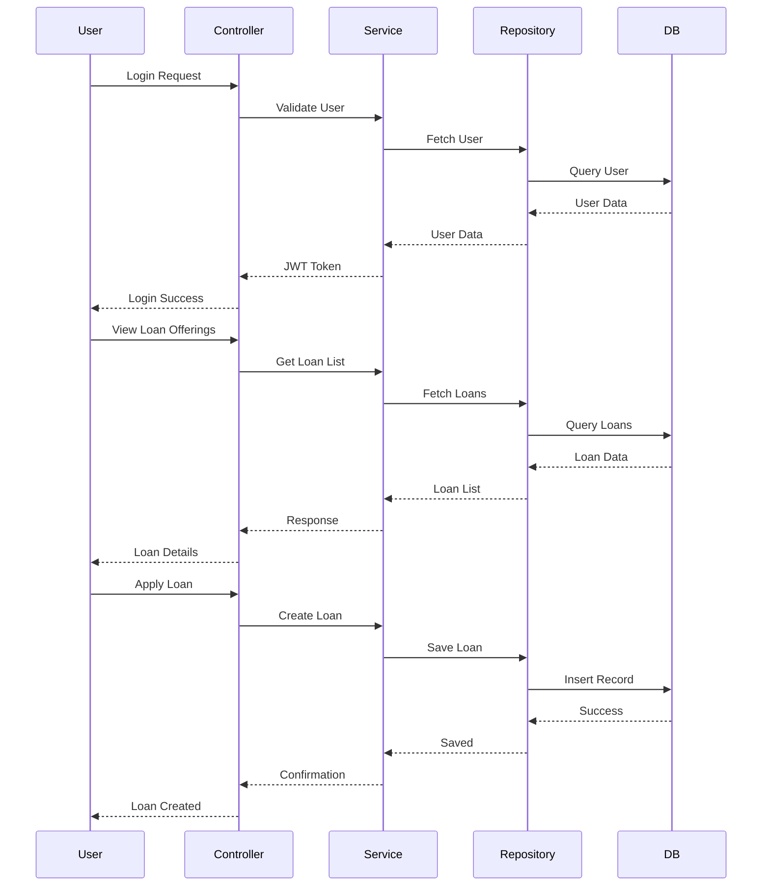

# Home Loan Management System

## Project Overview
The Home Loan Management System is a Spring Boot–based enterprise application designed to manage the complete lifecycle of home loans.  
The application provides secure authentication, role-based access control, loan offerings browsing, loan application, loan tracking, and a consolidated dashboard for customers and administrators.

The system ensures that:
- Customers can view and manage only their own home loans.
- Admin users can monitor and manage all customer loan information.
- Business rules and validations are enforced at both service and API levels.
- High-quality standards are maintained through comprehensive unit testing and static code analysis.

---

## Technology Stack
- **Java:** 17
- **Framework:** Spring Boot 3.4.x, Spring Framework
- **Security:** Spring Security (Authentication & Authorization)
- **API:** REST API / GraphQL 1.3.x
- **ORM:** Hibernate 6.2.x, Spring Data JPA 3.2.x
- **Database:** MySQL / PostgreSQL
- **Build Tool:** Maven / Gradle
- **Testing:** JUnit 5, Mockito
- **API Documentation:** Swagger UI / Postman
- **Server:** Embedded Tomcat
- **IDE:** Eclipse / STS / IntelliJ IDEA
- **Code Quality:** Static Code Analyzer (Sonar / equivalent)

---

## How to Setup & Run the Application

### Prerequisites
- Java 17 installed
- Maven or Gradle installed
- MySQL or PostgreSQL running
- Git installed

### Steps to Run
1. Clone the repository:
   ```bash
   git clone https://github.com/<your-username>/home-loan-management.git


## Architecture Overview

### High-Level Architecture

The Home Loan Management System is built using a multi-tier architecture following industry-standard best practices.  
The system is designed to be scalable, secure, and easy to maintain by clearly separating responsibilities across layers.

#### High-Level Components
- Client Layer (Web UI, Swagger UI, Postman)
- API Layer (REST / GraphQL Controllers)
- Business Layer (Services)
- Persistence Layer (Spring Data JPA / Hibernate)
- Security Layer (Spring Security)
- Database Layer (PostgreSQL)

#### High-Level Architecture Diagram


#### Low-Level Architecture Diagram


## Sequence Diagram



